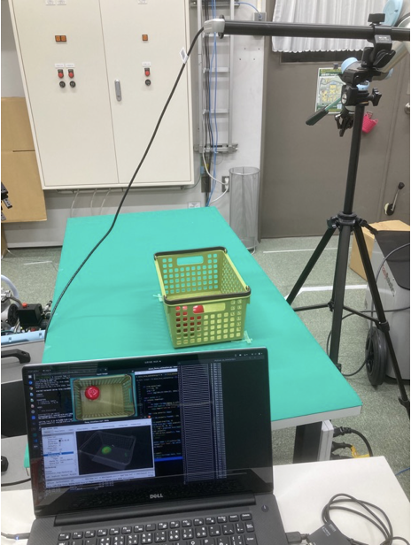

# Force Estimation


## Get trained weight
- Download from [here](https://drive.google.com/file/d/1iD7RR6gjkMiOk5yzUpmSsqvaVwTkv1YU/view?usp=sharing)
- Extract in runs directory

## Run the demo program

- Launch realsense driver
```
$ roslauch realsense2_camera rs_camera.launch filters:=pointcloud
```

- Launch 3D visualizer (RViz)
```
$ roslaunch force_estimation viewer.launch

```

- Run the demo program
```
$ roscd force_estimation/scripts
$ ./demo_force_estimation.py
```
